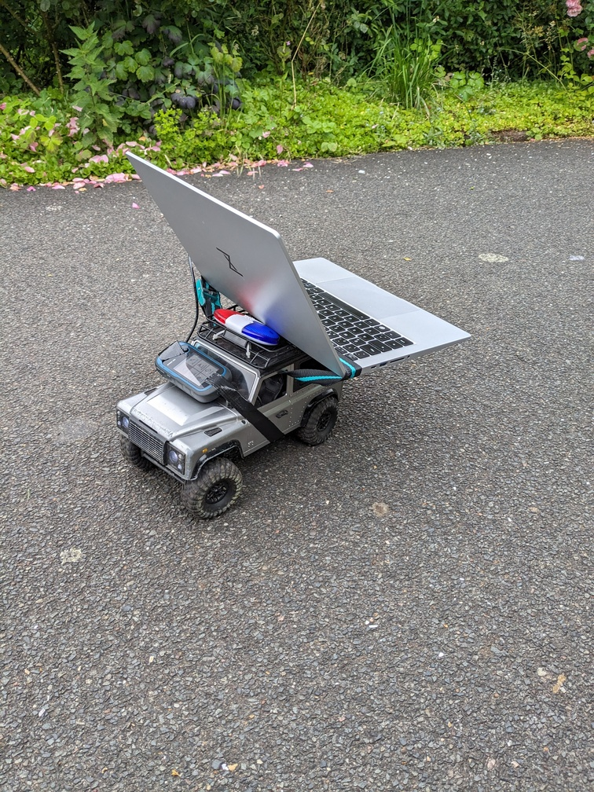
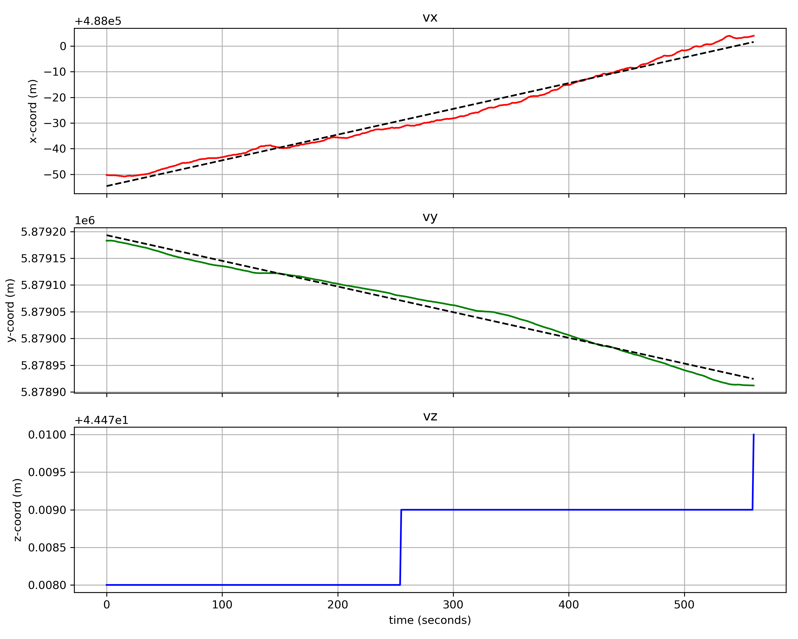

# Modifing DJI kmz files for automated grid flights

This collection of scripts orginates from the need to fly automated grid flights with a DJI Mavic 3 Drone over drifting sea ice conditions at high latitudes. Note, parts of this collection can also be used for other DJI Drones or when flying your DJI Mavic 3 over stable ground.

1. Generate gird flights for Mavic 3 Drones
2. Shift and rotate DJI KMZ files to different locations (can be necessary when working at high latitudes)
3. Estimate a drift vector from an nmea string
4. Correct grid flights for ice motion before upload to the Drone

#### Contact

Niklas Neckel <niklas.neckel@awi.de>
Steven Franke <steven.franke@awi.de>

## Generating a grid survey for your DJI Mavic 3 Drone

As grid surveys for photogrammetric flights are not supported for DJI Mavic 3 Drones we show a way around how this could be accomplished anyways. For this you need the QGIS Flightplanner plugin available here <https://plugins.qgis.org/plugins/flight_planner/>, a DEM or Geoid of your survey area and a polygon shapefile of your survey area in a metric coordinate system. The scripts porvided here support UTM zone 32N and a polar stereographic coordinate system for latitudes > 60°N.

  
  
  <figcaption>Figure 1: Experimental setup for ice drift estimation resulting in nmea string tmp3.txt and corresponding drift vector estimation.</figcaption>

